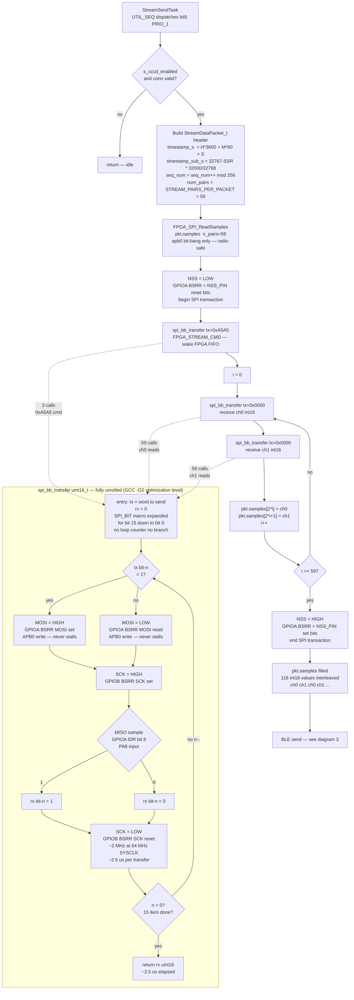
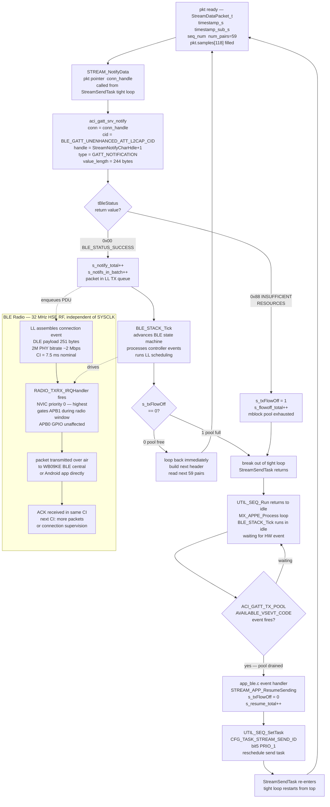

# Kuntur MCU — Architecture Diagrams

Paste each code block at https://mermaid.live to render.

---

## Diagram 1 — Startup & BLE Connection

```mermaid
flowchart TD
    A[POWER ON] --> B["SystemClock_Config\nRC64MPLL DIV1 = 64 MHz SYSCLK\nFLASH_WAIT_STATES_1"]
    B --> C["HAL init: RTC BYPSHAD=1\nLSE 32.768 kHz\nUSART1 115200 on PA1"]
    C --> D["FPGA_SPI_Init\nPB3=SCK  PA8=MISO\nPA11=MOSI  PA9=NSS\noverrides SPI3 AF pins on APB0"]
    D --> E["MX_APPE_Init\nBLE stack + GATT init\nSTREAM_APP_Init  DIS_Init"]
    E --> F["HAL_Delay 5000 ms\nSWD attach window\nprints 'starting...' on USART1"]
    F --> G["BLE advertising starts\nname = Kuntur-Headstage\nfast 80-100 ms interval\nLP VTIMER after 60 s"]
    G --> H{Phone connects?}
    H -->|no| G
    H -->|yes| I["connection_complete_event\nconn_handle saved\nATT_MTU = 247"]
    I --> J["hci_le_set_data_length\nTxOctets=251  TxTime=2120\nDLE extension request\nsequential: PHY must wait"]
    J --> K{"DATA_LENGTH_CHANGE\nMaxTxOctets=251?"}
    K -->|not yet| J
    K -->|confirmed| L["hci_le_set_phy\nALL_PHYS=0\nTX=LE_2M  RX=LE_2M"]
    L --> M{"LE_PHY_UPDATE event\nTxPhy=2?"}
    M -->|"2M confirmed"| O["2M PHY active\n~2 Mbps raw bitrate"]
    M -->|"1M — peer declined or unsupported\nno retry: firmware accepts 1M\nand continues normally"| O
    O --> P["STREAM_EventHandler waits for\nCCCD write on handle\nStreamNotifyCharHdle+2\nuuid 0xFFF2 CCCD"]
    P --> Q{"CCCD value\n= 0x0001?"}
    Q -->|0x0000 disabled| P
    Q -->|0x0001 enabled| R["STREAM_APP_OnCCCDWrite\ns_cccd_enabled = 1\nconn_handle saved to stream_app"]
    R --> S["HAL_VTIMER_StartTimerMs\nsend_timer period = STREAM_SEND_PERIOD_MS = 2 ms\nStreamSendTimerCb callback"]
    S --> T["StreamSendTimerCb fires\nUTIL_SEQ_SetTask\nCFG_TASK_STREAM_SEND_ID bit5 PRIO_1\nrescheduled every 2 ms"]
    T --> U[StreamSendTask — see diagram 2]
```

---

## Diagram 2 — FPGA SPI Acquisition (StreamSendTask tight loop)

---

## Diagram 3 — BLE Send & TX Flow Control

